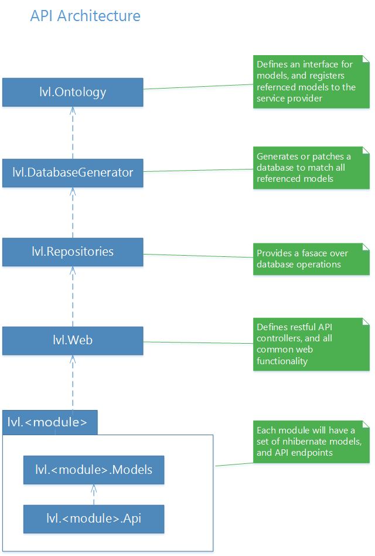

# lavalav
A collection of libraries and DevOps products. These products aim to reduce the time it takes to code, maintain, and release other products.


## Config
When setting up a C# application, the combined microservices will have the following configurations:
```
{
	domain: {
		// Connection String to be used by all the application.
		ConnectionString: string
	},
	logging: {
		LogLevel: Trace | Debug | Information | Warning | Error | Critical | None
	},
	cors: {
		AllowHeaders: string[],
		AllowMethods: string[],
		AllowOrigins: string[],
		ExposedHeaders: string[]
	},
	oidc: {
		authorization-server: {
			// If true, will populate data used in development and unit tests.
			SeedTestData: boolean,

			//If true, will populate data required by the application.
			SeedManditoryData: boolean (default true),

			// Will assign each new user the given roles.
			NewUserRoles: string[],

			// List of active directory servers which can be authenticated against.
			WindowsProviders: [{
				// Title which will be shown in GUIs.
				DisplayName: string,

				// The unique name of the provider.
				AuthenticationScheme: string
			}],

			// Information needed to use facebook as an Independent Service Provider.
			Facebook: {
				Id: string,
				Secret: string
			},

			// Information needed to use microsoft as an Independent Service Provider.
			Microsoft: {
				Id: string,
				Secret: string
			},

			// Information needed to use microsoft as an Independent Service Provider.
			Google: {
				Id: string,
				Secret: string
			}
		}
	}
}
```


```
When setting up an angular projects, the environment.ts file should have the following options:
{
    // Url to the api.
	resourceServerUrl: string,

    // required by angular cli
	production: boolean,

	// Server which issues tokens.
	authorizationServerUrl: string,

	// Identifier of the client registered on the authentication server.
	clientId: string,

	// The secret to validate the client identity.
	clientSecret: string,

	// The required scopes and permissions needed by the app to function.
	scopes: string[],

	// Roles which may be assigned by the administrator to users.
	roles: string[]
}
```


## Project Architecture


For details on an project's architecture, see its specific README.md