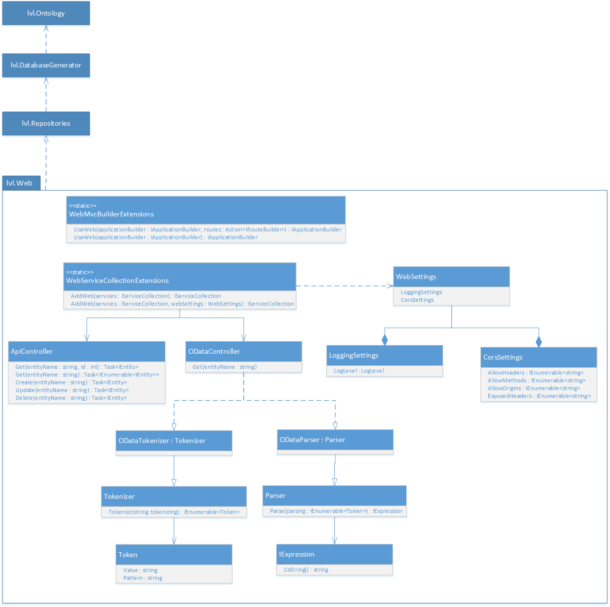

## Goals
Provide library of all code common to APIs.


## Endpoints
### Api
_All endpoints are subject to security._


`GET api/<entity-type>` will fetch all entities of a given type


`GET api/<entity-type>/<id>` will fetch an entity of a given type with the given identifier.


`POST api/<entity-type>` will create an entity with the body deserialized as the given type.


`PUT api/<entity-type>` will update an entity of a given type with the matching identifer, using the body deserialized as the given type.


`DELETE api/<entity-type>` will remove an entity of a given type with the matching identifier, using the body deserialized as the given type.


### OData
`GET odata/<entity-type>?<odata-query>` Will fetch all entities of a given type, after applying the odata query and security.


## Logging
When running in debug mode, the errors are logged to the console in addition to any other loggers.


Logs are also added to the database table `LogEntry`.


## Config
When setting up a appsettings.json, the options can be set:


```json
{
	logging: {
		LogLevel: Trace | Debug | Information | Warning | Error | Critical | None
	},
	cors: {
		AllowHeaders: [],
		AllowMethods: [],
		AllowOrigins: [],
		ExposedHeaders: []
	}
}
```


## Architecture
